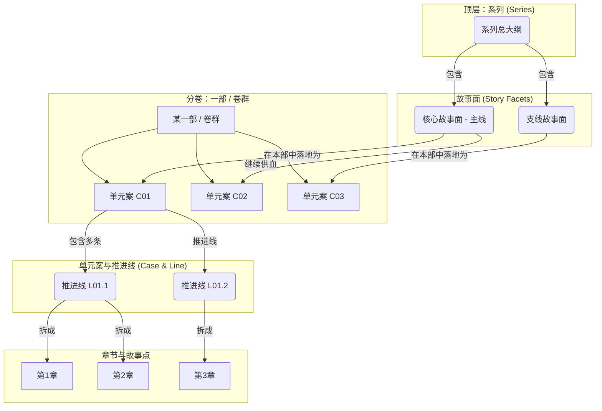

# 大纲公共裁判规则与统一编号体系

## 目标定位（作者向执行文档）

你正在创作或维护的是“作者用来写正文的执行版大纲”。它的首要价值不是给读者看的文采，而是：

- **可执行**：作者拿着它能直接拆章、写场景、写对话、推进线索与代价
- **可审计**：能与人物传记、时间轴、线索台账、嫌疑池台账互相核对
- **可联动**：总纲、分部、分卷、章清单与台账之间能互相回指，不各写各的
- **可修订**：后续连载增量调整时不至于整体失控

## 信息保真原则（强制）

- 跨层级通用信息包括但不限于：作者向执行原则、文件写入规则、调研与深度思考、统一编号体系、人物一致性、证据链硬口径、台账联动、标题规则、质量控制、特殊要求与指导
- 不得因为拆分而丢失任何已有要求
- 当不同层级文件出现冲突时，优先顺序默认为：
  1. 用户本轮明确要求
  2. 项目裁判源文件
  3. 当前公共硬约束
  4. 层级专属执行细则

## 故事不是主题口号

### 故事 vs 主题的判定标准

**错误写法**：只有主题判断，没有具体事件、人、时间、地点、动机与过程。

**正确写法**：必须同时具备：

- **WHO（人物）**：具体角色、身份、立场、关系
- **WHAT（事件）**：发生了什么、冲突如何推进
- **WHEN（时间）**：何时发生、持续多久、关键节点在哪
- **WHERE（地点）**：在哪发生、空间如何影响冲突
- **WHY（动机）**：人物为什么这样做
- **HOW（过程）**：事件如何一步步发生

### 故事面与故事线的具象化标准

**故事面**：必须是跨阶段 / 跨卷群的完整情节发展，包含明确人物主线、事件序列、时间线、场景设置、动机驱动与过程描述。

**故事线**：必须是单阶段内的具体情节链条，包含具体场景和事件、明确人物行动、清晰因果关系、可感知的冲突和转折。

## 全局统一编号体系（ID System）

为了在庞大的故事架构中实现精准交叉引用与可追溯性，所有故事面、情节块、故事线、线索、嫌疑与伏笔都应使用统一编号。

### 1. 故事面 ID（Facet ID）

- **主线谜团面**：`M0`（全书唯一）
- **重要支线面**：`X01`、`X02`……

### 2. 情节块 ID（Plot Block ID）

- **格式**：`C[编号]`
- **示例**：`C01`、`C02`
- **跨卷 / 跨阶段标注（可选）**：`C03@V2`

### 3. 故事线 ID（Storyline ID）

- **格式**：`L[案号].[编号]`
- **示例**：`L01.1`、`L01.2`

### 配套 ID（强烈建议）

- **线索 ID**：`CL[案号].[编号]`
- **嫌疑人 ID**：`SUS[案号].[编号]`
- **伏笔 / 回收 ID**：`FB[编号]`

### 使用要点

- **唯一性**：每个 ID 在整个项目中必须唯一
- **层级清晰**：通过 ID 能快速判断叙事单元层级与父级关系
- **强制使用**：在作者侧大纲文件标题和交叉引用处使用这套体系
- **读者隔离**：这些 ID 只服务作者内部规划、交叉引用、台账维护与审阅审计；除非某编号本身就是世界内自然存在的案件号 / 文书号并另有剧情依据，否则不得直接写进正文、多平台派生稿、章引语或 `作者有话说`

## 三级大纲架构体系（立体 → 面 → 线 → 点）

建议按以下逻辑拆解长篇：

全书（长篇整体）→ 主线谜团面（M0）→ 单元案 / 情节块（Cxx）→ 推进线（Lxx）→ 章节故事点（Scene / Chapter）

## 技术规范与质量控制

### 大纲层级架构严格要求（统一粒度口径）

- **总大纲**：战略故事面层级，跨阶段 / 跨卷存在
- **分部大纲**：战役故事线层级，跨卷存在
- **分卷大纲**：执行故事点层级，章节内存在

### 文件命名统一规范

- 总大纲：`总大纲.md`
- 分部大纲：`X.《部标题》- 详细大纲.md`
- 分卷大纲：`X.Y.《卷标题》- 分卷大纲.md`
- 章节文件：`X.《章节标题》.md`

### 内容质量最低标准

- 所有故事元素必须具象化，绝不允许概念化描述
- 每个故事必须包含完整的六要素（WHO / WHAT / WHEN / WHERE / WHY / HOW）
- 人物行动必须有明确的动机和逻辑链条
- 职业程序、证据链、规则约束必须自洽可追溯，避免“为了反转而反转”

### 跨层级一致性检查

- 下级大纲必须完整承接上级大纲，不得遗漏或曲解
- 人物传记与大纲描述必须完全一致，不得出现人设矛盾
- 时间线、地点、技术发展必须前后一致
- 主题思想的表达必须在各层级保持连贯性

## 绝对禁止的敷衍行为

- 抽象概念代替故事
- 缺失故事要素
- 一句话概括关键情节
- 用空洞概念填充
- 人物无名化、事件虚化、时空模糊
- 层级混乱、体量不匹配、逻辑断层
- 将多个故事面的发展阶段混成一句话敷衍
- 只描述伏笔功能，不描述具体埋设与揭示过程

## 成功标准

- 逻辑严密、人物丰满、主题和主线清晰
- 每个“故事面”和“故事线”都是真正的故事，而不是抽象概念
- 大纲中的每个关键工件都能回指到对应人物、台账、时间线和下游执行文件

## 问题诊断模板

### 故事具象化问题检查

- 是否所有故事面都包含了具体人物、事件、时间、地点、动机、过程？
- 是否存在用主题概念代替具体故事的情况？
- 人物是否有具体姓名、身份与行动？
- 事件是否有明确起因、过程、结果？
- 时间地点是否精确到可执行程度？

### 粒度问题检查

- 是否存在“一句话情节”问题？
- 各层级深度是否与层级定位匹配？
- 内容是否能支撑实际写作体量？

### 逻辑问题检查

- 各层级之间的承接关系是否清晰？
- 是否存在逻辑跳跃或断层？
- 编号系统与台账映射是否完整？
- 伏笔设置是否合理可回收？

### 质量问题检查

- 人物塑造是否立体？
- 主题表达是否通过事件链自然传达？
- 现实关怀与职业细节是否充分？

## 快速修复流程

1. **问题识别**：先定位主要问题类型（具象化 / 粒度 / 逻辑 / 质量）
2. **故事具象化修复**：将抽象概念替换为包含六要素的具体故事
3. **层级调整**：确保内容粒度与层级匹配
4. **体量补充**：按层级需求补到最低可执行深度
5. **逻辑梳理**：修复层级间承接关系与台账映射
6. **质量提升**：增强事件链、人物、代价与回报
7. **交叉验证**：对照人物、台账、时间轴和上游 / 下游文件复核
